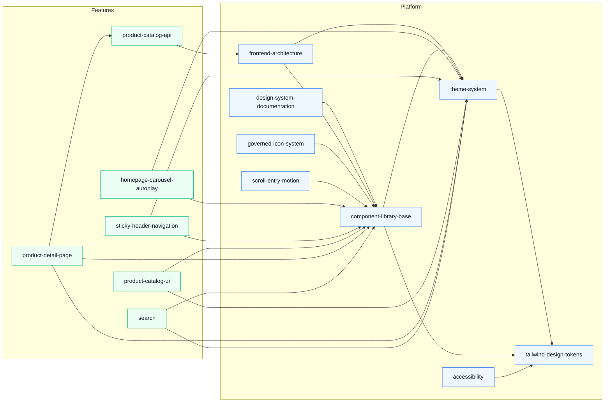

# OpenSpec Architecture Constitution

This document defines the long-term architecture rules for the OpenSpec repository.
It preserves all existing specifications, adds structure for future growth, and prevents
platform and feature concerns from becoming mixed again.

## 1. Current Project Audit

| Specification               | Type     | Reason                                                                                                    |
| --------------------------- | -------- | --------------------------------------------------------------------------------------------------------- |
| tailwind-design-tokens      | Platform | Defines reusable design tokens that other specs consume through shared CSS variables and typed constants. |
| component-library-base      | Platform | Defines reusable UI primitives that multiple features depend on.                                          |
| theme-system                | Platform | Defines global theme state, palette behavior, and runtime styling infrastructure.                         |
| design-system-documentation | Platform | Documents reusable design system assets and adoption guidance for the whole product.                      |
| homepage-carousel-autoplay  | Feature  | Describes homepage behavior and a user-facing interaction pattern tied to a specific screen.              |
| sticky-header-navigation    | Feature  | Describes catalog/navigation behavior at the page level rather than a reusable foundation.                |
| product-catalog-ui          | Feature  | Describes customer-facing catalog presentation and filtering behavior.                                    |
| product-detail-page         | Feature  | Describes a business page for product detail discovery and conversion support.                            |
| product-catalog-api         | Feature  | Describes domain-specific API behavior for the catalog feature, not a shared platform service.            |

## 2. Platform vs Feature Classification

| Specification               | Layer    | Classification Rule                                               |
| --------------------------- | -------- | ----------------------------------------------------------------- |
| tailwind-design-tokens      | Platform | Shared foundation, slow-moving, consumed by many specs.           |
| component-library-base      | Platform | Reusable primitives with broad application across the UI surface. |
| theme-system                | Platform | Cross-cutting runtime infrastructure for styling and appearance.  |
| design-system-documentation | Platform | Shared guidance for how the platform layer is used and extended.  |
| homepage-carousel-autoplay  | Feature  | Business experience for the homepage, not a shared foundation.    |
| sticky-header-navigation    | Feature  | Page-level navigation behavior tied to product discovery flows.   |
| product-catalog-ui          | Feature  | Customer-facing feature implementation for catalog browsing.      |
| product-detail-page         | Feature  | Customer-facing feature implementation for detail exploration.    |
| product-catalog-api         | Feature  | Feature-scoped API contract for catalog behavior and queries.     |

## 3. Proposed Folder Structure

The project should evolve toward a two-layer architecture while keeping the current structure
intact during migration.

```text
openspec/
  architecture.md
  platform/
    design-system/
      tailwind-design-tokens/
        proposal.md
        design.md
        tasks.md
        specs/
          tailwind-design-tokens/
      component-library-base/
        proposal.md
        design.md
        tasks.md
        specs/
          component-library-base/
      theme-system/
        proposal.md
        design.md
        tasks.md
        specs/
          theme-system/
      design-system-documentation/
        proposal.md
        design.md
        tasks.md
        specs/
          design-system-documentation/
    accessibility/
      proposal.md
      design.md
      tasks.md
      specs/
        <accessibility-specs>
    frontend-architecture/
      proposal.md
      design.md
      tasks.md
      specs/
        <architecture-specs>
  features/
    homepage/
      carousel-autoplay/
        proposal.md
        design.md
        tasks.md
        specs/
          homepage-carousel-autoplay/
    navigation/
      sticky-header/
        proposal.md
        design.md
        tasks.md
        specs/
          sticky-header-navigation/
    product-catalog/
      ui/
        proposal.md
        design.md
        tasks.md
        specs/
          product-catalog-ui/
      api/
        proposal.md
        design.md
        tasks.md
        specs/
          product-catalog-api/
    product-detail/
      proposal.md
      design.md
      tasks.md
      specs/
        product-detail-page/
    search/
      proposal.md
      design.md
      tasks.md
      specs/
        <search-specs>
  changes/
    <active-change-directories>
  specs/
    <legacy-compatibility-index-during-migration>
  archive/
    <completed-or-superseded-change-history>
```

### Structure rules

- Platform specs live under `platform/` and define reusable foundations.
- Feature specs live under `features/` and define business capabilities or user journeys.
- Each spec keeps the existing artifact pattern: `proposal.md`, `design.md`, `tasks.md`, and `specs/`.
- The current `changes/` area remains available during migration for backwards compatibility.
- The legacy root `specs/` area may remain as an index or compatibility layer until every reference is updated.

## 4. Ownership Matrix

| Folder                                  | Purpose                                                         | Owner                                  | Who can modify it                                          | Who can consume it                                    | Dependencies                                                                |
| --------------------------------------- | --------------------------------------------------------------- | -------------------------------------- | ---------------------------------------------------------- | ----------------------------------------------------- | --------------------------------------------------------------------------- |
| openspec/platform                       | Root for shared foundation specs                                | Architecture or platform team          | Platform owners and reviewers for shared foundations       | All feature teams                                     | No dependency on feature folders                                            |
| openspec/platform/design-system         | Visual language, tokens, components, theme, and design guidance | Design systems owner                   | Platform team and design systems maintainers               | Every feature team                                    | May depend on lower-level platform primitives only                          |
| openspec/platform/accessibility         | Cross-cutting accessibility standards                           | Accessibility owner or platform team   | Platform owners with accessibility review                  | All feature teams                                     | Depends only on platform rules and external standards                       |
| openspec/platform/frontend-architecture | Frontend-wide patterns, boundaries, and technical conventions   | Frontend architecture owner            | Platform architects                                        | All feature teams and platform teams                  | Depends only on platform standards, never on feature specs                  |
| openspec/features                       | Root for business capability specs                              | Product and feature teams              | Feature owners, product managers, and implementation leads | Feature teams, QA, and platform consumers             | May depend on platform specs only                                           |
| openspec/features/homepage              | Homepage behavior and journeys                                  | Homepage owner                         | Homepage team                                              | Teams that consume homepage contracts or UI           | May depend on design system and shared layout rules                         |
| openspec/features/navigation            | Sticky and navigational customer flows                          | Navigation or catalog experience owner | Feature owners responsible for navigation behavior         | Teams that render navigation or header surfaces       | May depend on platform navigation primitives only                           |
| openspec/features/product-catalog       | Catalog browsing UI and API contracts                           | Catalog product team                   | Catalog team, API owners, and reviewers                    | Catalog UI, backend, and integration consumers        | May depend on platform components, theme, and tokens                        |
| openspec/features/product-detail        | Product detail behavior and page contracts                      | Product detail owner                   | Product detail team                                        | Product page consumers and related integration owners | May depend on platform and catalog domain contracts                         |
| openspec/features/search                | Search behavior and search-adjacent user journeys               | Search owner                           | Search feature team                                        | Search UI, API, and analytics consumers               | May depend on platform search patterns and shared components                |
| openspec/changes                        | Active change workspace                                         | OpenSpec maintainers                   | Contributors working on active changes                     | Reviewers and implementers                            | May reference both platform and feature specs, but should not redefine them |
| openspec/archive                        | Completed or superseded work history                            | OpenSpec maintainers                   | Maintainers only, except for archival metadata updates     | Everyone as read-only history                         | No forward dependency; archival only                                        |
| openspec/specs                          | Temporary compatibility layer during migration                  | OpenSpec maintainers                   | Maintainers during migration only                          | All readers until migration is complete               | Mirrors or indexes current authoritative specs                              |

## 5. Dependency Diagram



### Dependency rules

- Features may depend on platform specs.
- Platform specs must not depend on feature specs.
- Feature-to-feature dependencies should be avoided unless they are mediated by a platform contract or an explicit shared spec.
- If a spec needs shared behavior, the reusable behavior must be extracted into platform rather than duplicated in multiple features.

## 6. Governance Rules

### Discovery and trust presentation capabilities

Governed Icons and Scroll-entry Motion are reusable Design System Platform
capabilities. Feature code consumes the closed semantic Icon registry and the
opt-in visible-by-default motion primitive; it may not import glyph sources or
create local viewport observers as competing contracts.

Search remains a Product Catalog Feature capability using the canonical public
Product collection. Payment Information remains static Homepage content and
introduces no Backend, Product, checkout, order or transaction state. These
Feature meanings never flow into the Icon or Motion Platform APIs.

Homepage Merchandising Layout V2 consumes the additive Platform merchandising
layout contract: an opt-in 1400px Container and domain-neutral CollectionGrid
with one semantic DOM order. Homepage owns section order, uncapped Category
meaning, Featured limits and daily selected-Category behavior; Platform layout
does not own or modify those collections.

Daily Category selection and its maximum-six canonical Products are composed on
the server from canonical taxonomy/catalog predicates in one consistent snapshot
using the `America/Bogota` business date. React receives the projection and does
not reroll or personalize it. The promotional Carousel remains presentation-
owned static content and adds no Banner persistence/API.

Product Detail contact/share is an additive continuation boundary. The server
constructs one canonical Product URL from governed public-origin configuration
after slug resolution and an optional `wa.me` URL from the approved business
number. Frontend may progressively invoke native Share/Clipboard, but no
third-party SDK, lead persistence, Product mutation, visitor profiling or
arbitrary request-host URL construction is permitted. The canonical Feature
contract is `features/product-detail/contact-sharing-v1.md`.

### Shared catalog taxonomy capability

Category Taxonomy V1 is the reusable catalog-domain contract for Category,
Subcategory, and Product Type. Homepage, Product Catalog, Category exploration,
Product Detail, Search, Featured Products, and Related Products consume this
contract and may not maintain a competing flat Category source.

The authoritative leaf classification is Product Type. Subcategory and Category
are inherited through the approved hierarchy. Taxonomy business specifications
belong to the Product Catalog feature domain after the active change is
released; visual, accessibility, and frontend-wide rules remain in Platform.

Only one taxonomy version may be Active for public discovery. Changes to stable
identifiers, slugs, hierarchy ownership, or Product Type meaning require a new
reviewed change and coordinated compatibility decision.

### Administrative catalog capability

Admin Catalog Management V2 is an isolated operational capability, not public
customer authentication. It uses exactly one Deployment-bootstrapped protected
Superadministrator and multiple fixed-role Administrators. Named opaque sessions,
managed-edge proof, same-origin/CSRF validation, persistent throttling and safe
audit are cumulative controls; username/password does not replace the edge.

The Superadministrator alone manages Administrator creation, password reset,
deactivation and reactivation. Product and Category create/edit/retire/restore
commands are explicit aggregate operations with optimistic concurrency,
non-cascading retirement and immutable historical slug ownership. Catalog Media
Admin remains the only Product/Category Image mutation boundary. The active
canonical contract is `features/product-catalog/admin-catalog-management-v2.md`.

### Product content and Variant aggregate

Product is the catalog aggregate boundary for Product Variants, Product Images,
merchandising metadata and SEO content. Product Variant belongs to exactly one
Product and owns its stable SKU and approved attributes. Product Image belongs to
exactly one Product; Variant media association cannot cross Product ownership.

Product Type remains the sole taxonomy leaf. Variant Active state remains
independent from Product publication and Commercial Availability. Product-level
price and currency remain authoritative in V1. Inventory, cost, supplier,
warehouse, tax, logistics and Variant-level pricing require separate reviewed
capabilities.

Reusable gallery and option interaction belongs to Platform, while Product Image
order, Variant resolution, vocabulary and business state remain feature-owned.

### Project layers

- Platform is the reusable foundation for design, interaction, accessibility, and frontend architecture.
- Features are the business-facing experiences that can evolve independently.
- Migration and archive areas are operational, not product layers.

### Dependency direction

- Dependencies always flow from features to platform.
- Platform defines contracts and primitives first; features consume them afterward.
- No platform spec may import, reference, or rely on feature-specific requirements as a source of truth.

### Ownership

- Platform specs are owned by the teams responsible for system-wide consistency.
- Feature specs are owned by the teams responsible for the product experience in that domain.
- Shared review is required whenever a change crosses the boundary between the two layers.

### Modification rules

- Never rewrite business requirements in order to fit the folder structure.
- Never delete specifications during migration; preserve all content and history.
- Prefer additive changes to platform specs.
- If a platform spec must change in a breaking way, document the compatibility impact and the migration path in the same change.
- Feature specs may evolve independently, but they must continue to comply with platform contracts.
- Reclassification is allowed only when the true ownership and reuse pattern is clear.

### Naming conventions

- Use kebab-case for folders and spec identifiers.
- Platform names should describe reusable foundations, such as design-system, theme-system, component-library-base, and accessibility.
- Feature names should describe user-facing capabilities or journeys, such as product-catalog, product-detail, homepage, search, and navigation.
- Keep names stable once published. If a name must change, preserve the old path as a compatibility reference until all consumers move.

### How new features are added

1. Create a new folder under `openspec/features/<feature-name>/`.
2. Add the standard artifact set: `proposal.md`, `design.md`, `tasks.md`, and `specs/`.
3. Define the business scope only. Do not move reusable platform concerns into the feature folder.
4. Reference platform dependencies explicitly instead of recreating them.
5. Review the change for cross-layer drift before implementation begins.

### How reusable platform specifications evolve

1. Add or update reusable behavior under `openspec/platform/`.
2. Keep changes additive whenever possible.
3. Document contracts, assumptions, and compatibility expectations.
4. Avoid feature-specific terminology inside platform specs unless it is an intentional shared abstraction.
5. If a feature needs behavior that is broadly reusable, extract that behavior into platform before duplicating it.

## 7. Migration Plan

The transition should preserve all existing work and avoid breaking readers or contributors.

### Phase 1: Introduce the new structure

- Create the `platform/` and `features/` roots in the OpenSpec model.
- Keep the current `changes/` tree untouched while the migration is planned.
- Publish this architecture document as the canonical reference for classification and ownership.

### Phase 2: Mirror existing specs into the new layer model

- Map each existing spec to its destination folder under either platform or features.
- Keep the source content unchanged while the new location is introduced.
- Add compatibility indexes or pointers so contributors can still find the old locations during the transition.

### Phase 3: Move one domain at a time

- Migrate platform specs first, because they are the foundation for feature specs.
- Then migrate feature specs by domain, starting with the least coupled change sets.
- After each migration, update references, links, and discovery entries.
- Validate that no business requirement changed during the move.

### Phase 4: Stabilize and enforce the boundaries

- Once the new structure is in place, require future specs to choose a layer before approval.
- Route reusable concerns to platform and domain-specific behavior to features.
- Keep the legacy paths available as read-only compatibility references until the team confirms every consumer has moved.

### Phase 5: Prevent regression

- Review new specs against the ownership matrix before approval.
- Reject changes that place feature logic inside platform or shared foundation logic inside features.
- Keep the migration plan visible in the repository so future contributors understand the intended shape of the system.

### Transition guarantee

- No existing specification is deleted.
- No business requirement is rewritten.
- No feature behavior is changed by this reorganization alone.
- Backwards compatibility is preserved through the migration window.
